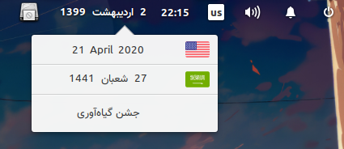

#  Wingpanel Calendar Indicator
<h4 align="center">
          
</h4>

<h1 align="center">
    
</h1>

## Building and Installation

You'll need the following dependencies:

 - `libgtk-3-dev`
 - `json-glib-1.0`
 - `libwingpanel-2.0-dev`
 - `meson`
 - `valac`

Run `meson` to configure the build environment and then ninja to build:

```
meson build --prefix=/usr
cd build
ninja
```

To install, use ninja install:

`sudo ninja install`

### Distributions
#### Void [[WIP](https://github.com/void-linux/void-packages/pull/21155)]

## Donate
- Monero: `48VdRG9BNePEcrUr6Vx6sJeVz6EefGq5e2F5S9YV2eJtd5uAwjJ7Afn6YeVTWsw6XGS6mXueLywEea3fBPztUbre2Lhia7e`


## License

